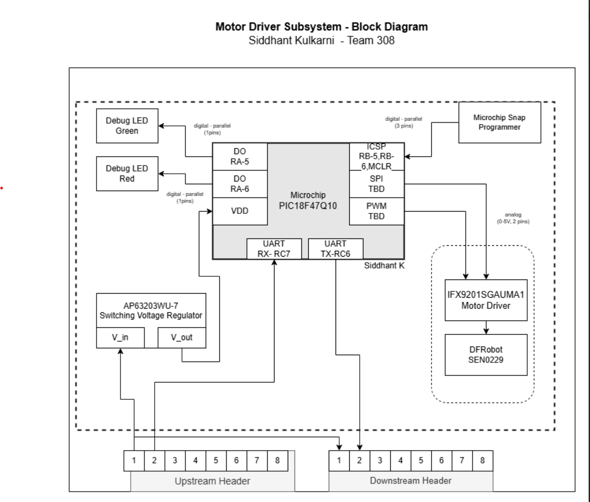

**Link to Drive:**

[Block Diagram](https://drive.google.com/drive/folders/19I_488VRz9nsvQRNoa4jgeBesulI3tln?dmr=1&ec=wgc-drive-hero-goto)

**Overall Team Subsystem Layout:**

**Legend:**

**Internet Connection Subsystem:**

**Humidity and Temperature Subsystem:**

**Motor-Pump Subsystem:**

**LCD Subsystem:**

