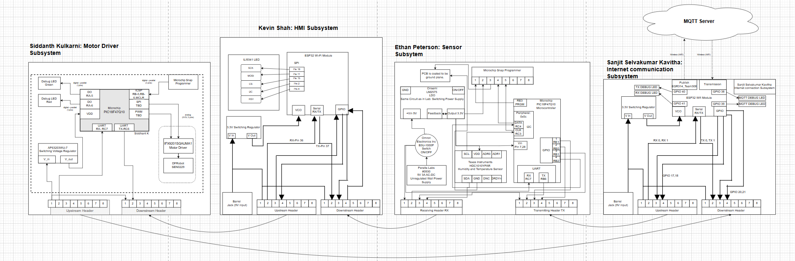

**Link to Drive:**

[Block Diagram](https://drive.google.com/drive/folders/19I_488VRz9nsvQRNoa4jgeBesulI3tln?dmr=1&ec=wgc-drive-hero-goto)

**Overall Team Subsystem Layout:**

Look under Individual block diagrams for a closer look into our block diagrams describing the temperature and humidity sensor system.

---
How did the decision making process operate for how we made our block diagram:
---

Our block diagram is a simplified version of what we wanted to create for our project. It demonstrates that we have met the product requirements, as each individual system passed its checkoff by incorporating the necessary components for its subsystem design.

However, all designs required a voltage regulator, a UART plug-in, a microcontroller, and clearly defined TX and RX connections. Each block diagram must explicitly indicate where the TX and RX lines connect to the microcontroller. If this is not explicitly stated, it must be evident from the schematic corresponding to that subsystem.

The block diagram provides a basic overview of the system’s layout and operation. Additionally, it helps illustrate how information flows within the team. As shown, the data starts with Sanjit, moves to Ethan, then Kevin, and finally reaches Siddhant, who operates the actuator.
